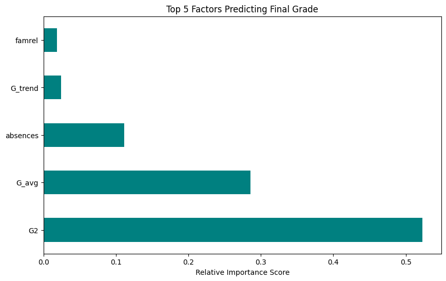
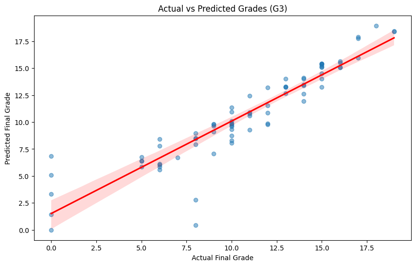

# 🎓 Smart Student Performance Predictor v2.0

##  Project Overview
This project is an advanced Machine Learning pipeline designed to predict a student's final academic grade ($G3$) based on mid-term performance and socio-economic factors. 

While my previous version focused purely on behavioral discovery, this version incorporates **Time-Series academic data** ($G1$ and $G2$) to achieve significantly higher accuracy. This mimics a real-world academic intervention system used to identify at-risk students before the semester ends.

##  Key Features
*   **Predictive Modeling**: Utilizes Random Forest Regression to handle non-linear relationships between social habits and grades.
*   **Feature Engineering**: Developed custom indicators:
    *   `G_trend`: Captures the improvement or decline between the first and second periods.
    *   `G_avg`: Calculates overall academic momentum.
*   **Data Mining**: Extracts patterns to show how family relationships and absences "tilt" the final outcome.

##  Model Performance
By including previous grades, the model's reliability saw a massive jump compared to behavioral-only models:
*   **R-Squared ($R^2$) Score**: **0.85** (Explains 85% of the variance).
*   **Mean Absolute Error (MAE)**: **1.09** (Predictions are typically within ~1 grade point of the actual result).

##  Visual Insights

### 1. Factor Importance
As shown in `image_62c365.png`, the most recent grade ($G2$) and the engineered academic average are the most dominant predictors.

### 2. Regression Analysis
The model demonstrates a strong linear correlation between actual and predicted grades, with very few outliers.

##  Tech Stack
*   **Language**: Python
*   **Libraries**: Pandas, Scikit-Learn, Matplotlib, Seaborn
*   **Algorithm**: Random Forest Regressor

##  Dataset
The project utilizes the **Student Performance Dataset** (UCI Machine Learning Repository), which includes:
*   **Academic**: Grades G1, G2, G3.
*   **Demographics**: Age, address, family size.
*   **Social**: Study time, absences, free time, and alcohol consumption.

##  How to Use
The script includes a `predict_student_performance` function. It allows educators to input current student data to receive an immediate final grade forecast and risk assessment.

---
*Developed as part of my continuous learning journey in AI and Machine Learning.*
